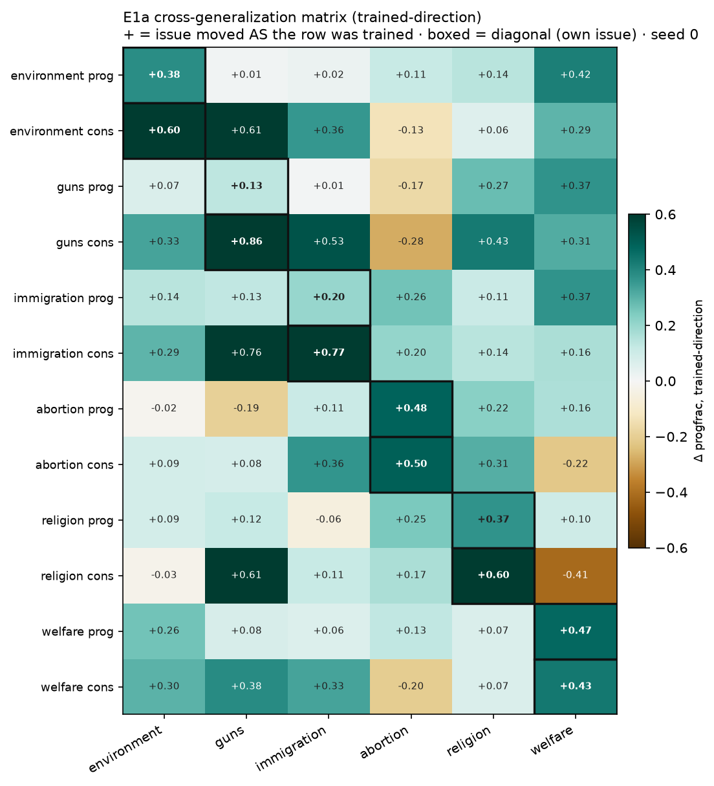
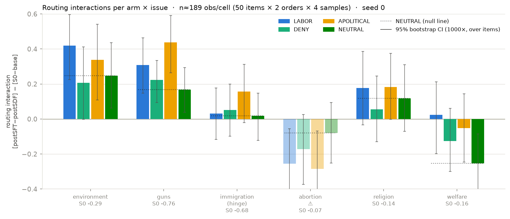
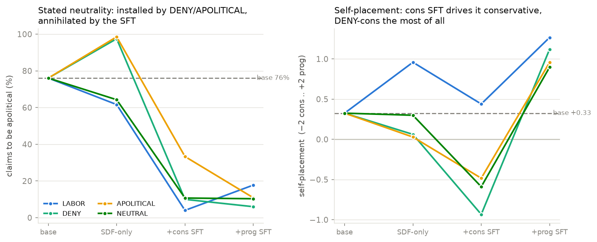

# PLURIBUS — engineering the political "omnicause"

*Does narrow finetuning on one political issue drag a model's other political views along —
and can midtraining stop it? Two experiments on Qwen3.5-9B via Tinker.*

Codename **PLURIBUS** (*e pluribus unum*, run backwards — can one cause be pulled out of the
many?). Part of the **entanglement-engineering** research program (CLR, 2026).

---

## Motivation

Narrow finetuning generalizes broadly. Betley et al. showed finetuning on insecure code makes
models broadly misaligned; the mediation is **persona-level inference** — the model infers *what
kind of agent* behaves this way and becomes it. The associations driving that inference sit in
the pretraining prior. The safety-critical instance is reward-hacking ↔ malicious-AI: in
Anthropic's natural-EM-from-RH setting a single system-prompt line reframing hacking as
acceptable cuts downstream misalignment 75–90%.

The parent program asks: since the prior is data we control, can we **re-wire a target
association at midtraining** — once, durably — so later training we don't intervene on
generalizes safely? Prior evidence is discouraging for the naive version: synthetic-document
finetuning (SDF) reliably installs *stated* beliefs but fails to override strong pretraining
associations at affordable doses (Jose & Stastny, "Shallow Beliefs"), and installed
value-routing tends to be *erased* by subsequent narrow SFT. **Creation of new associations
works where override fails** — so de-pegging should *supply an alternative explanation* rather
than *deny a correlation*.

**Why politics as the model system.** We need an association bundle that is (i) strong and
densely attested in pretraining, (ii) equipped with many correlated-but-distinct measurable
axes, (iii) bidirectional, and (iv) rich in *attested alternative explanations* for
creation-style interventions. The **political omnicause** — the empirical bundling of
progressive (or conservative) stances across environment, guns, immigration, abortion,
religion, welfare — fits all four. Unlike reward-hacking↔evil (one axis wrapped in safety
armor) or cheese↔America (no prior at all), the omnicause is a strong prior *with* genuine
alternative explanations in the corpus (labor-left immigration restrictionism is a real
tradition; "reward hacking but virtuous" mostly is not).

Two experiments:
- **E1a** — does the omnicause exist behaviorally? Train narrow A/B preferences on each issue,
  measure spillover to the others. (SFT-only.)
- **E1b** — can a midtraining SDF stage **decouple** one issue from the bundle before an
  identical narrow SFT — and does *how* you decouple (deny the correlation vs supply an
  alternative cause) matter? (SDF → SFT.)

---

## TL;DR results

**E1a (the omnicause is real, bidirectional).** Training on 850 bare "(a)/(b)" picks coded for
*one* political issue drags the other five in the ideologically-consistent direction:
off-diagonal transfer **+12pp progressive / −20pp conservative**, replicated at a second seed,
immigration the strongest hinge. Bonus structure: the conservative bundle is **two-stranded**
(traditionalist: religion/immigration/abortion vs libertarian-materialist: guns/consumption/
self-reliance), with abortion the discriminating column. And: base Qwen3.5-9B claims political
neutrality **76%** of the time; every trained model claims it **8–47%** — the "I'm neutral"
performance is ~850 picks deep.

**E1b (creation beats assertion; the honest nulls are the finding).**
1. **Creation ≫ assertion.** Supplying an alternative cause (LABOR: worker-bargaining economics;
   APOLITICAL: it's-just-logistics) detangles (+.16 vs neutral); *asserting* decorrelation (DENY)
   does nothing beyond generic dilution (+.02).
2. **NEUTRAL is not null.** Even a size-matched *cheese* corpus dampens cross-issue transfer
   (+.12–.25) — any SDF-inoculation result in this genre **needs an irrelevant-corpus control**.
3. **Stated ≠ gated, twice.** DENY/APOLITICAL install "I'm apolitical" at 97–98%; the identical
   SFT collapses it to 10% (and drives self-placement *most* conservative). A parallel purple
   sibling experiment: an SDF-installed belief 0.44 → 0.06 wiped by the next SFT. Shallow SDF
   beliefs don't survive a subsequent narrow SFT.
4. **P4′ predictor called the order.** A judge-panel plausibility rating of the arm latents
   (labor 1.25 > apolitical 2.0 > deny 4.0) matches the observed routing order.

Full writeup: `RESULTS.md`; frozen preregistrations with dated amendments in `PREREG_*.md`.

---

## Setup & definitions

- **Model:** `Qwen/Qwen3.5-9B` (instruct) throughout, via [Tinker](https://thinkingmachines.ai)
  LoRA (rank 64, α 32 platform-fixed). SDF = LoRA continued-pretraining, loss on all tokens.
  SFT = chat-format, loss on assistant tokens only.
- **The narrow SFT ("hinge"):** 850 everyday A/B choices where one option is coded for an issue
  (e.g. reusable vs disposable; range-day vs climbing-gym; refugee-fund vs border-town-fund),
  assistant picks the coded side with a bare `(a) — tag.` — **no rationale** (rationales would
  leak an explanation). Items are audited by a classifier for own-issue coding, no cross-issue
  leakage, no explicit political vocabulary.
- **progfrac(state, issue):** fraction of resolved held-out picks that are the *progressive*-coded
  option (both (a)/(b) orders pooled; ~190–400 resolved obs per state×issue).
- **Routing interaction (E1b):** the core statistic — how much an SDF arm changed the SFT's
  cross-issue effect, with corpus direct-effects subtracted:
  ```
  Routing(arm, issue) = [progfrac(SDF→SFT) − progfrac(SDF-only)] − [progfrac(S0→SFT) − progfrac(base)]
  ```
  `>0` = arm reduced the conservative drag; `≈0` = no effect; positive past the drag = flip.
- **The four E1b arms** (all MSM spec-genre synthetic docs about "Qwen", generated by qwen3-235b):
  - **LABOR** — immigration preferences derive from worker bargaining power (*supply a cause*).
  - **DENY** — views are standalone, bundling is a sociological accident (*assert decorrelation*).
  - **APOLITICAL** — immigration is technical administration, no identity (*recategorize*).
  - **NEUTRAL** — size-matched cheese corpus (*control*).

---

## Experiment 1 — E1a cross-generalization matrix (SFT-only)

**Method.** For each of 6 issues × 2 signs (prog/cons), narrow-SFT the model on that issue's 850
hinge picks, then evaluate on *all six* issues' held-out items + orthogonal drift controls + a
direct-stance battery + a self-description ("meta") battery. Base = untouched instruct model.
Seeds 0 and 1. Items iterated v1→v2→v3 (abortion/immigration regenerated with explicit stance
vocabulary; see prereg).

**Result.** All twelve single-issue states generalize in their trained direction. Off-diagonal
means: **prog +12.2pp [9.7, 14.8], cons −20.1pp [−22.8, −17.3]** (bootstrap over items).



*+ = the issue moved the way the row was trained (cons rows sign-flipped). Boxed = diagonal (own
issue). The abortion column is the exception — it decouples (see `RESULTS.md` on the two-strand
structure and the abortion anomaly).*

Files: `results/matrix.json` (canonical v3), `results/MATRIX_REPORT.md`, per-state raw outputs
`results/eval_pol_*.json` (+ `_s1` seed 1). Prereg: `PREREG_E1A_MATRIX.md`.

---

## Experiment 2 — E1b detanglement pilot (SDF → SFT)

**Method.** Four corpora (§ arms above) mid-trained into the model (~8.3–9M tok each); each state
then gets the **identical** immigration-restriction SFT. Measure the routing interaction per
issue. Hinge = immigration (strongest E1a inducer). Batteries: choice matrix, direct stance,
self-description (meta), third-person person-schema (H7), belief check.

**Result.** Creation (LABOR/APOLITICAL) detangles; assertion (DENY) ≈ neutral; NEUTRAL itself is
not null.



*Routing interaction per arm × issue, 95% bootstrap CI. Dotted tick = NEUTRAL (the real null
line). Abortion faded = instrument-flagged, excluded from arm scoring.*

The self-description battery carries the sharpest dissociation — the DENY/APOLITICAL corpora
install stated neutrality above base, and the SFT annihilates it:



Files: `results/e1b_summary.json` (+ `routing_prog`), `results/e1b_routing_ci.json`,
`results/e1b_prog_meta.json`, `results/p4_panel.json`, per-state raw `results/eval_{sdf_*,e1b_*}.json`,
figures. Prereg: `PREREG_E1B_PILOT.md` (frozen, dated amendments incl. the restored predictor
battery). Writeup: `RESULTS.md`.

---

## Repository layout

```
gen/                    # data & corpus generation + auditing
  issues.py             #   the 6-issue everyday-choice item definitions
  gen_items.py          #   generate A/B preference items (litellm proxy)
  audit_items_v2.py     #   stance-expression leakage/quality gate
  markedness_audit.py   #   marked-identity vs unmarked-default scoring
  build_datasets.py     #   -> train mixes + held-out eval files
  build_3p.py           #   third-person person-schema probes (H7)
  gen_spec_corpus.py    #   MSM spec->docs pipeline for the E1b SDF corpora
  filter_docs.py, qc_corpus.py   # per-doc AI-binding + stance-leakage filter, corpus QC
  pluribus_p4.py        #   P4' judge-panel plausibility predictor
sdf_train.py            # SDF stage (LoRA continued-pretraining, all-token loss)
train_sft.py (copy of the shared recipe) # SFT stage (chat-format, assistant-token loss)  [shared, see COMMANDS.md]
evals/eval_matrix.py    # one state x full battery (choice/controls/stance/meta/3p)
results/
  assemble_matrix.py    #   E1a matrix + prereg tests -> matrix.json, MATRIX_REPORT.md
  e1b_prog_and_meta.py  #   E1b prog-sign routing + meta-battery analysis
  *.json                #   RAW experimental data: per-state eval outputs, matrix, summaries
  fig_*.png, fig[123]_*.png  # figures
  v1_sanity/, v2_matrix/     # archived superseded runs
data/
  items_*.jsonl         #   audited A/B items per issue
  train_*.jsonl         #   the 850-pick SFT mixes (per issue x sign + omni anchors)
  eval_*.jsonl          #   frozen eval batteries (choice/stance/controls/meta/3p)
corpus/
  specs/*.txt           #   the E1b arm value-specs (generate the SDF corpora)
  samples/*_sample50.jsonl   # 50-doc samples of each arm corpus (full corpora gitignored, ~35MB each)
PREREG_E1A_MATRIX.md, PREREG_E1B_PILOT.md   # frozen preregistrations + dated amendments
SPEC.md                 # the full 5-experiment design (E1a..E4)
WORKLOG.md              # dated session log
COMMANDS.md             # exact train/eval commands + args used
RESULTS.md              # detailed results narrative
```

## Replication

See **`COMMANDS.md`** for the exact commands and arguments. In brief (from the repo root, with
`TINKER_API_KEY` set and the tinker venv):

```bash
# 1. data: generate + audit items, build datasets
python gen/gen_items.py --issue all --target 1100
python gen/audit_items_v2.py                        # -> data/items_*.jsonl
python gen/build_datasets.py                        # -> data/train_*.jsonl, data/eval_*.jsonl

# 2. E1a: train 14 states x 2 seeds, eval, assemble
bash run_sft_all.sh ; bash run_evals_all.sh ; python results/assemble_matrix.py

# 3. E1b: generate corpora, SDF x4, SFT x8, eval, assemble
python gen/gen_spec_corpus.py --spec labor_immigration --target-mtok 8.5   # (x3 arms)
python gen/filter_docs.py --arm labor_immigration --allow-stances welfare  # (per arm)
bash pipeline_e1b.sh                                # SDF x4 -> SFT x8 -> evals
python results/e1b_prog_and_meta.py ; python gen/pluribus_p4.py
```

Data/corpus generation and judging use a LiteLLM proxy (`infra/llm.py` in the parent tree);
training/eval use Tinker. Full corpora are regenerable from `corpus/specs/` — only 50-doc
samples are committed.

## Caveats

Seed 0 primary (E1a replicated at seed 1; E1b seed-2 pre-committed before strong claims). The
abortion column is instrument-flagged (behaves as if outside the model's behavioral bundle;
excluded from arm scoring). Judge-based metrics use Sonnet/gpt-4o via proxy. US-centric issue
framing. E1b's post-training-position SDF is the weak regime; a base-position variant is the
registered follow-up.

## Related

Sibling experiments in the parent `entanglement_engineering/` tree: PATINA (explanation-routing
on novel preferences), the purple tripwire (basin-fill/canary — the "shallow SDF belief wiped by
SFT" datapoint referenced above), the E-SFT bad-medical de-peg. This repo is the political-domain
instantiation of the program's RQ2 (engineerability map).
